## Project: Build a Traffic Sign Recognition Program
[](http://www.udacity.com/drive)

Overview
---
In this project, you will use what you've learned about deep neural networks and convolutional neural networks to classify traffic signs. You will train and validate a model so it can classify traffic sign images using the [German Traffic Sign Dataset](http://benchmark.ini.rub.de/?section=gtsrb&subsection=dataset). After the model is trained, you will then try out your model on images of German traffic signs that you find on the web.

We have included an Ipython notebook that contains further instructions 
and starter code. Be sure to download the [Ipython notebook](https://github.com/udacity/CarND-Traffic-Sign-Classifier-Project/blob/master/Traffic_Sign_Classifier.ipynb). 

We also want you to create a detailed writeup of the project. Check out the [writeup template](https://github.com/udacity/CarND-Traffic-Sign-Classifier-Project/blob/master/writeup_template.md) for this project and use it as a starting point for creating your own writeup. The writeup can be either a markdown file or a pdf document.

To meet specifications, the project will require submitting three files: 
* the Ipython notebook with the code
* the code exported as an html file
* a writeup report either as a markdown or pdf file 

The Project
---
The goals / steps of this project are the following:
* Load the data set
* Explore, summarize and visualize the data set
* Design, train and test a model architecture
* Use the model to make predictions on new images
* Analyze the softmax probabilities of the new images
* Summarize the results with a written report

### Dependencies
This lab requires:

* [CarND Term1 Starter Kit](https://github.com/udacity/CarND-Term1-Starter-Kit)

The lab environment can be created with CarND Term1 Starter Kit. Click [here](https://github.com/udacity/CarND-Term1-Starter-Kit/blob/master/README.md) for the details.

### Dataset and Repository

1. Download the data set. The classroom has a link to the data set in the "Project Instructions" content. This is a pickled dataset in which we've already resized the images to 32x32. It contains a training, validation and test set.
2. Clone the project, which contains the Ipython notebook and the writeup template.
```sh
git clone https://github.com/udacity/CarND-Traffic-Sign-Classifier-Project
cd CarND-Traffic-Sign-Classifier-Project
jupyter notebook Traffic_Sign_Classifier.ipynb
```


## Project Writeup
### Data Set Summary & Exploration

#### 1. Provide a basic summary of the data set. In the code, the analysis should be done using python, numpy and/or pandas methods rather than hardcoding results manually.

Basic summary of dataset using pandas as follows,

- The dataset consist of 32x32 pixel RGB images with labeled with traffic sign class.
  - The size of training set is `34799` images.
  - The size of the validation set is `4410` images.
  - The size of test set is `12630`.
  - The shape of a traffic sign image is `32x32x3` (RGB).
  - The number of unique labels/classes in the data set is `43`. 


#### **2. Include an exploratory visualization of the dataset.**

Sample images for each class:

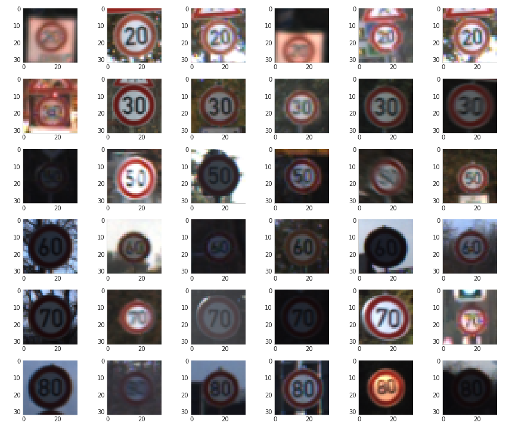

Lets take average to understand them better, class means:

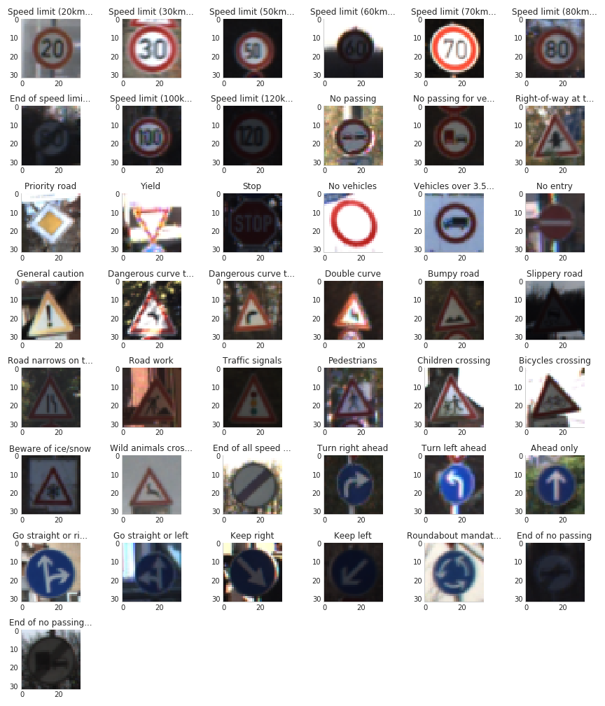
We can see there are some classes that contains mostly dark images, that could make our classifier more baised towards those labels with darker images.

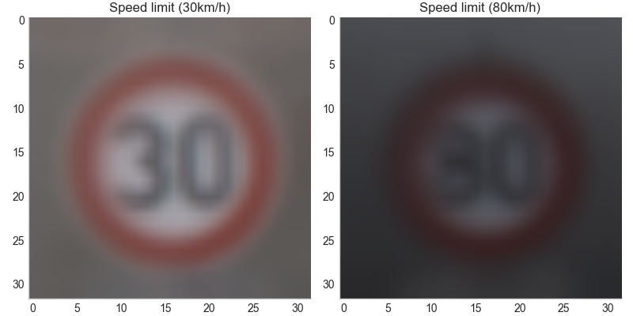

Considering these two classes, we can also get mistaken for one for other.

In dataset there are some images that are mirrors of each others, such as 'keep right' and 'keep left' signs. This could be limitation on using data augmentation in later parts.

There are some images which look exactly similar to each other,  it may be due to images taken while driving car

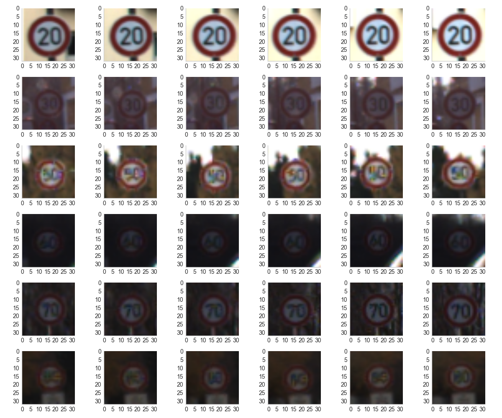


Some variations in images in dataset:


When looking at the class distribution, we find that some classes are severely underrepresented compared to others. While there are 180 examples for the 20 km/h speed limit, we find about 2010 examples for the 50 km/h speed limit. The average number of examples per class was 809, at a median of 540.

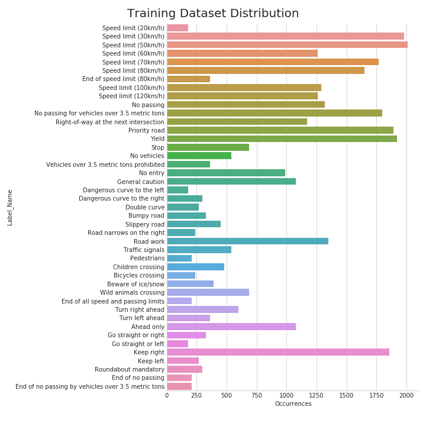

We can mitigate this problem by augmenting those images in underrepresented classes and then uniform sampling within the class.


### Design and Test a Model Architecture

#### 1. Describe how you preprocessed the image data. What techniques were chosen and why did you choose these techniques? Consider including images showing the output of each preprocessing technique. Pre-processing refers to techniques such as converting to grayscale, normalization, etc.

Images were normalized `-1...1` values to build baseline and then passed to model.

Further normalization on training data was carried out by mean and variance.

using [imgaug](https://github.com/aleju/imgaug) library added scale, rotation and shift augmentation which gave higher validation and test accuracy.

 Here's an example of an unaltered input image:


By adding randomized augmentations, here's one possible variation of the above image:


#### 2. Describe what your final model architecture looks like including model type, layers, layer sizes, connectivity, etc.) Consider including a diagram and/or table describing the final model.

My final model consisted of two convolutional and three fully connected layers
the following layers:

|        Layer        |              Description              |
| :-----------------: | :-----------------------------------: |
|        Input        |           32x32x3 RGB image           |
| Range normalization |                                       |
|   Convolution 5x5   | 1x1 stride, valid padding, 6 filters  |
|        RELU         |                                       |
|   Max pooling 2x2   |              2x2 stride               |
|   Convolution 5x5   | 1x1 stride, valid padding, 16 filters |
|        RELU         |                                       |
|   Max pooling 2x2   |              2x2 stride               |
|   Fully connected   |          120 output neurons           |
|        RELU         |                                       |
|   Fully connected   |           84 output neurons           |
|        RELU         |                                       |
|   Fully connected   |           43 output neurons           |
|       Softmax       |                                       |

#### 3. Describe how you trained your model. The discussion can include the type of optimizer, the batch size, number of epochs and any hyperparameters such as learning rate.

The model was trained using the Adam optimizer with a learning rate of 1e-4 and, at times, 1e-3 and 1e-5. The training was bottlenecked by the CPU, so batch size was kept fairly small at around 32 images per batch so as to not stall in the single-threaded preprocessing part for too long. The number of epochs was varied between 100 and 1000, however no improvement was observed after approximately 300 epochs; due to time constraints, between 100 and 200 epochs were used ultimately.

#### 4. Describe the approach taken for finding a solution and getting the validation set accuracy to be at least 0.93. Include in the discussion the results on the training, validation and test sets and where in the code these were calculated. Your approach may have been an iterative process, in which case, outline the steps you took to get to the final solution and why you chose those steps. Perhaps your solution involved an already well known implementation or architecture. In this case, discuss why you think the architecture is suitable for the current problem.

My final model results were:
* The following image shows a training accuracy around `1.0`. 
* validation set accuracy of `0.9605` 
* test set accuracy `0.8653`

##### Training accuracy

Training accuracy quickly went toward `1.0`, indicating beginning of overfitting.
Due to dataset augmentation however, training accuracy grew as well.

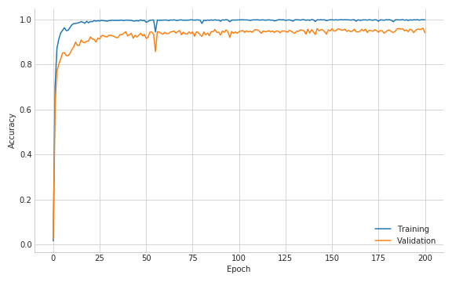

##### Training loss

Loss reduced over iterations, which shows that lower learning rates and higher epochs will be helpful.

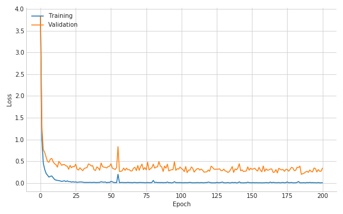


If a well known architecture was chosen:

- What architecture was chosen?

I choose the well-known LeNet-5 model to finish this traffic sign classification task.

- Why did you believe it would be relevant to the traffic sign application?

Because we have successfully solved the handwritten digits multi-classification task with this model. And the image in MNIST dataset is 32x32x1, the image in this traffic sign dataset is 32x32x3.

In order to prevent overfitting, I also insert some dropout layers between the fully connected layer

- How does the final model's accuracy on the training, validation and test set provide evidence that the model is working well?

I achieved the training set accuracy of 0.995, the validation set accuracy of 0.9605, the test set accuracy of 0.8653. So we can see this model works very well.

### Test a Model on New Images

#### 1. Choose five German traffic signs found on the web and provide them in the report. For each image, discuss what quality or qualities might be difficult to classify.

extra images were used to test the accuracy of the network:


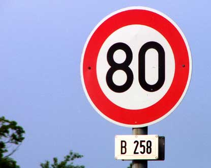
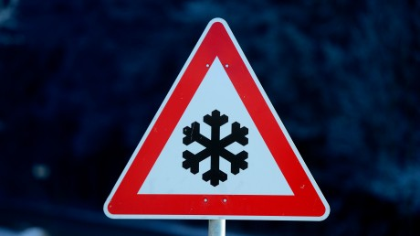
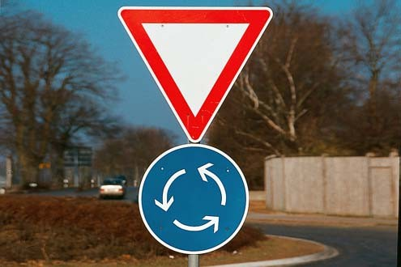
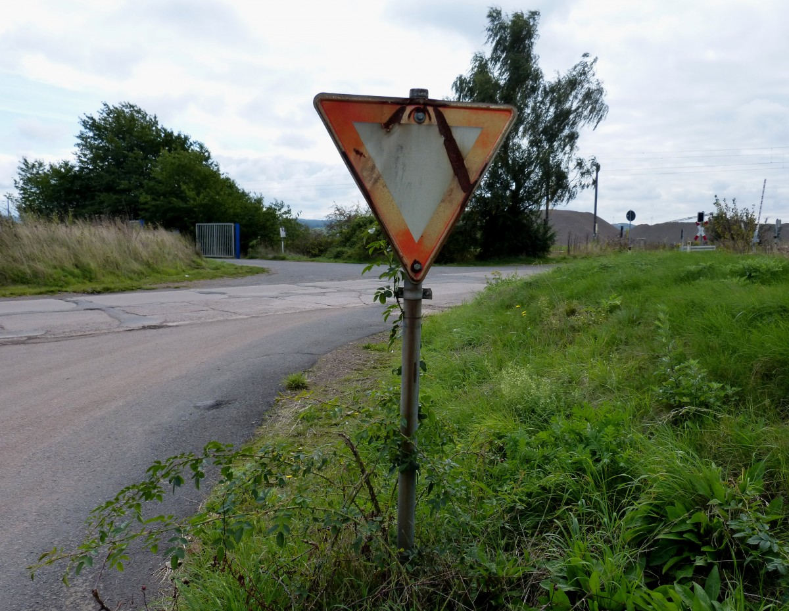

When images are cropped to process the sign area in the image, There pixel values are reduces to fit into model. 
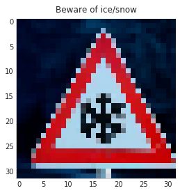
Lets consider above image, in this image black pixels of snow sign are merged due to reduced quality. This can be hard for classifier to predict because it look like different shape that snow.
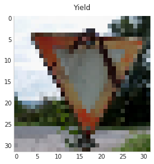
Above cropped yield image feed to classifier, considering the quality of image yield sign is naturally tampered with rust. Which overlapping the right portion of triagle, data augmentation can harm the classifier here because augmating image can lead to different prediction. That's why classifier predicted as 70 Km/h , which is wrong classification.

#### 2. Discuss the model's predictions on these new traffic signs and compare the results to predicting on the test set. At a minimum, discuss what the predictions were, the accuracy on these new predictions, and compare the accuracy to the accuracy on the test set (OPTIONAL: Discuss the results in more detail as described in the "Stand Out Suggestions" part of the rubric).
- Evaluation accuracy for test dataset was `0.8653`
- Evaluation accuracy with test images result in 4/6 (`0.67`) accurate.

Test dataset accuracy `86.53%` VS Given five images `67% (4/6)`.
Accuracy of captured images got from online, it is somewhat exceptable considering image dirty images but model need to be trained on such bad images to make model more robust to such images. We can also solve this problem with generating adversarial images using GANs (Generative Adversarial Networks) and training model on such advesarial images.  

For dirty Yield image was blured and naturally tampered rust on the sign, model was not completely robust to such images.
For Beware of ice/snow image, classifier got confused because 2 points of snow sign got merged in low qaulity cropped image.

Here is results of predictions using LeNet architecture,

|     Image(True)      |      Prediction      | Confidence |
| :------------------: | :------------------: | :--------: |
| 70 km/h speed limit  | 70 km/h speed limit  |    1.00    |
| 80 km/h speed limit  | 80 km/h speed limit  |    1.00    |
| 30 km/h speed limit  |  Beware of ice/snow  |    0.98    |
| Roundabout mandatory | Roundabout mandatory |    1.00    |
|        Yield         |        Yield         |    1.00    |
|        Yield         | 70 km/h speed limit  |    0.90    |


#### The top five softmax probabilities of the predictions on the captured images

- Sample 0: Speed limit (70km/h)

	1.00 Speed limit (70km/h)

	0.00 Speed limit (20km/h)

	0.00 Speed limit (120km/h)

	0.00 Speed limit (30km/h)

	0.00 Road narrows on the right

- Sample 1: Speed limit (80km/h)

	1.00 Speed limit (80km/h)

	0.00 Speed limit (50km/h)

	0.00 Speed limit (120km/h)

	0.00 Speed limit (100km/h)

	0.00 Speed limit (30km/h)

- Sample 2: Beware of ice/snow

	0.98 Speed limit (30km/h)

	0.02 Beware of ice/snow

	0.00 Speed limit (100km/h)

	0.00 Children crossing

	0.00 Speed limit (70km/h)

- Sample 3: Roundabout mandatory

	1.00 Roundabout mandatory

	0.00 Ahead only

	0.00 Turn right ahead

	0.00 Turn left ahead

	0.00 Go straight or right

- Sample 4: Yield

	1.00 Yield

	0.00 Beware of ice/snow

	0.00 No vehicles

	0.00 Traffic signals

	0.00 Road narrows on the right

- Sample 5: Yield

	0.90 Speed limit (70km/h)

	0.07 Speed limit (30km/h)

	0.03 No vehicles

	0.00 Yield

	0.00 Speed limit (50km/h)
